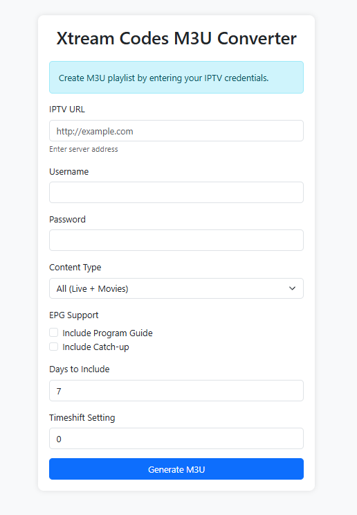
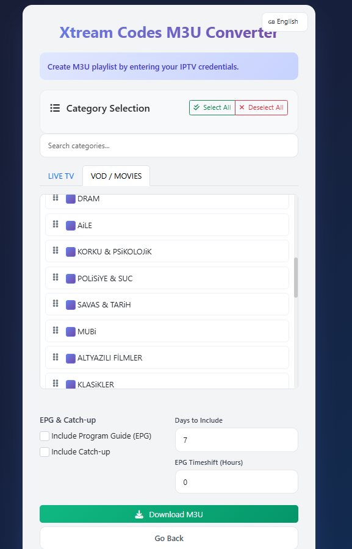

# Xtream Codes to M3U Converter

A powerful, user-friendly Node.js application that converts Xtream Codes API credentials into an M3U playlist file. It features a modern web interface, multi-language support, and advanced category management.




## 🚀 Key Features

*   **Xtream Codes API Support**: Connects to any IPTV provider using Xtream Codes API.
*   **M3U Generation**: Creates standard `.m3u` playlist files compatible with VLC, Perfect Player, Tivimate, etc.
*   **Category Management (NEW!)**:
    *   **Fetch & Select**: Retrieve categories from the server and select only what you want.
    *   **Drag & Drop Sorting**: Reorder categories simply by dragging them. The M3U will follow your custom order.
    *   **Bulk Actions**: "Select All" and "Deselect All" buttons for quick management.
*   **Content Filtering**: Choose to include Live TV, Movies (VOD), or both.
*   **EPG & Catch-up**: Optional support for Electronic Program Guide (EPG) and Catch-up (TV Archive).
*   **Modern UI**: Responsive, dark-themed interface built with Bootstrap 5 and custom CSS.
*   **Multi-Language**: Supports English (EN), Turkish (TR), German (DE), and French (FR).
*   **Privacy Focused**: No data is stored on the server. Credentials are passed directly to the IPTV provider.

## �️ Installation

### Prerequisites

*   **Node.js**: Version 14.0 or higher.
*   **NPM**: Usually comes with Node.js.

### Steps

1.  **Clone the repository** (or download usage):
    ```bash
    git clone https://github.com/your-repo/xtreamcodes-m3u.git
    cd xtreamcodes-m3u
    ```

2.  **Install dependencies**:
    ```bash
    npm install
    ```

3.  **Start the application**:
    ```bash
    npm start
    ```

4.  **Access**: Open your browser and go to `http://localhost:3000`.

## 📖 Usage

1.  **Enter Credentials**:
    *   **IPTV URL**: Your provider's URL (e.g., `http://example.com:8080`).
    *   **Username**: Your IPTV username.
    *   **Password**: Your IPTV password.

2.  **Fetch Categories**:
    *   Click the **"Fetch Categories & Edit"** button.
    *   The app will verify your credentials and load available Live TV and VOD categories.

3.  **Customize**:
    *   **Select**: Check the boxes for the categories you want to keep.
    *   **Sort**: Drag and drop category items to change their order in the playlist.
    *   **Filter**: Use the "Select All" / "Deselect All" buttons or the search bar.
    *   **Settings**: Enable EPG, Catch-up, or adjust the number of days to include.

4.  **Download**:
    *   Click **"Create M3U"** to download your customized `playlist.m3u` file.

## ⚙️ Configuration

The application runs on port `3000` by default. You can modify this in `app.js` if needed.

## 🤝 Contributing

Contributions are welcome! Please feel free to submit a Pull Request.

## 📄 License

This project is open-source and available under the [MIT License](LICENSE).